# ⁂ RumpusDots ⁂

Managed via Dotbare


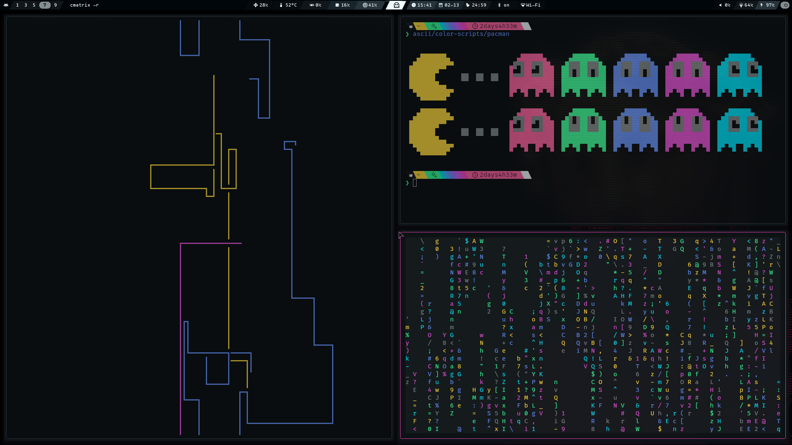

<table>
<tr>
<td>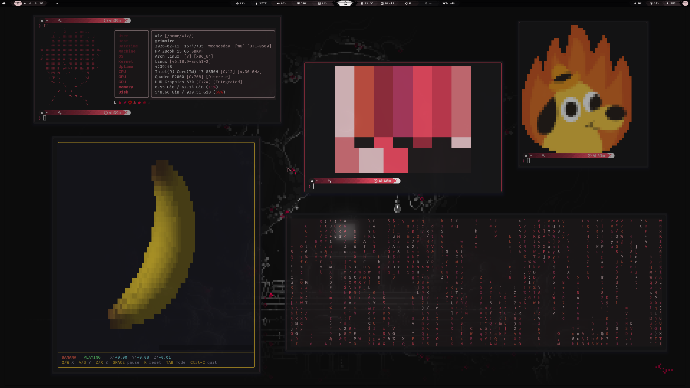<br><strong>Cardiac</strong></td>
<td>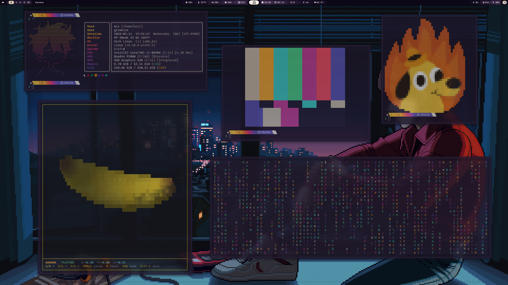<br><strong>Cassette</strong></td>
<td>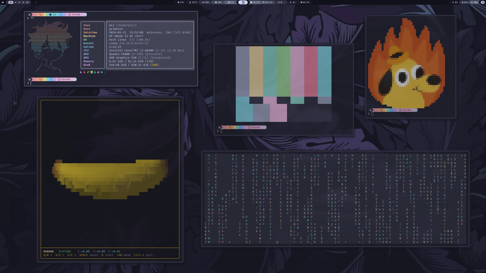<br><strong>Catppuccin</strong></td>
</tr>
<tr>
<td>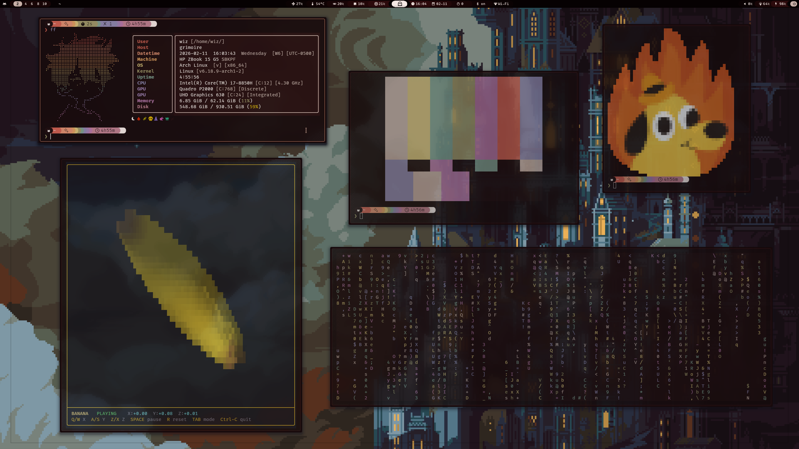<br><strong>Cavelight</strong></td>
<td>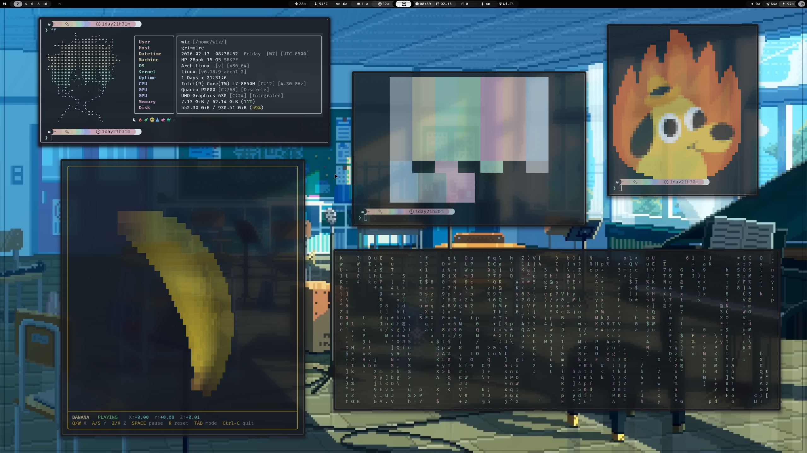<br><strong>Chalkboard</strong></td>
<td>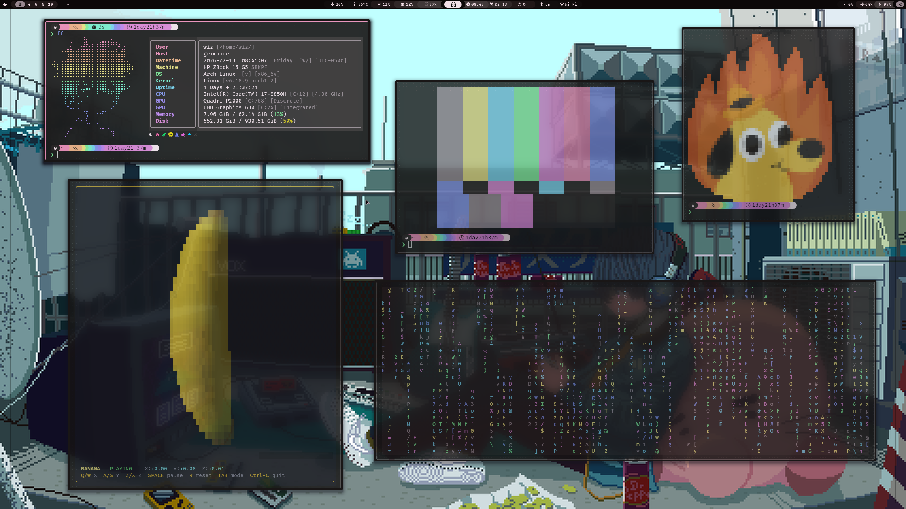<br><strong>Confetti</strong></td>
</tr>
<tr>
<td>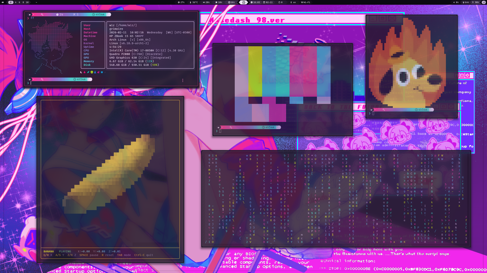<br><strong>Crystal</strong></td>
<td>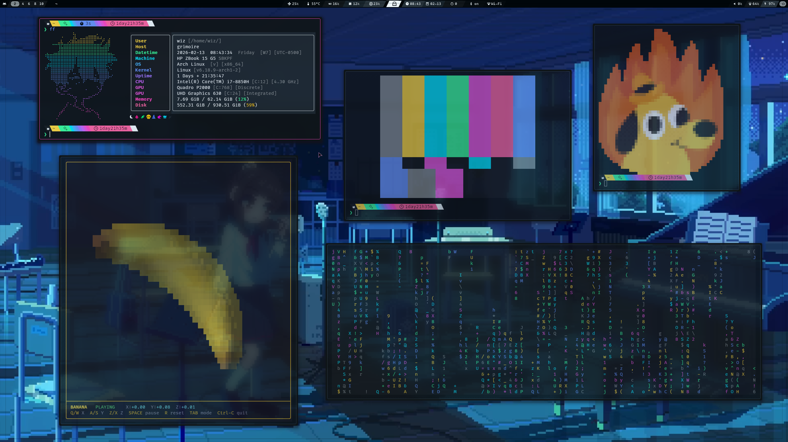<br><strong>Cyberpunk</strong></td>
<td>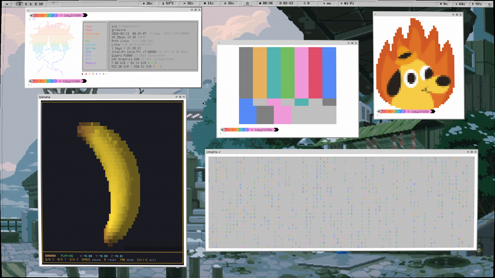<br><strong>Win98</strong></td>
</tr>
</table>

## Table of Contents

- [Overview](#overview)
- [How It Works](#how-it-works)
- [Features](#features)
- [Requirements](#requirements)
- [Installation](#installation)
- [Theme System](#theme-system)
  - [Palettes](#palettes)
  - [Templates](#templates)
  - [Generation](#generation)
  - [Application](#application)
  - [Overrides](#overrides)
- [Creating a Custom Theme](#creating-a-custom-theme)
- [Waybar](#waybar)
  - [Module Layout](#module-layout)
  - [Scripts](#waybar-scripts)
- [Hyprland](#hyprland)
  - [Configuration Structure](#configuration-structure)
  - [Keybinds](#keybinds)
  - [Scripts](#hyprland-scripts)
  - [Shaders](#shaders)
  - [Idle & Lock](#idle--lock)
- [Rofi Applets](#rofi-applets)
- [Dunst](#dunst)
- [Wlogout](#wlogout)
- [Kitty](#kitty)
- [Fastfetch](#fastfetch)
- [Zsh](#zsh)
  - [Module Structure](#module-structure)
  - [Plugins](#plugins)
  - [Aliases](#aliases)
  - [Custom Functions](#custom-functions)
  - [Key Bindings](#zsh-key-bindings)
  - [Completion System](#completion-system)
  - [fzf](#fzf)
  - [Starship Prompt](#starship-prompt)
- [Desktop Theming](#desktop-theming)
- [Themed Applications](#themed-applications)
- [Custom Scripts](#custom-scripts)
- [Repository Structure](#repository-structure)

## Overview

This repository uses Git's bare repository pattern to track dotfiles across the entire home directory without symlinks or complex tooling. Configuration files live in their native locations (`~/.config/...`) and are managed by a bare repo at `~/.dotfiles`.

On top of file tracking, a template-driven theme engine generates consistent color schemes, font settings, and UI styles for every configured application from a single palette definition.

## How It Works

```
┌─────────────────────────────────────────────────────────┐
│                    Palette (JSON)                       │
│  colors, fonts, style, gradient definitions             │
└──────────────────────┬──────────────────────────────────┘
                       │
                       ▼
┌─────────────────────────────────────────────────────────┐
│              generate-theme.sh                          │
│  1. Parse palette with jq                               │
│  2. Resolve color references (two-pass)                 │
│  3. Calculate contrast foregrounds                      │
│  4. Export 100+ env vars                                │
│  5. Run envsubst on all templates                       │
└──────────────────────┬──────────────────────────────────┘
                       │
          ┌────────────┼────────────┐
          ▼            ▼            ▼
    ┌──────────┐ ┌──────────┐ ┌──────────┐
    │ kitty.   │ │ waybar.  │ │ hypr-    │  ... 30+ output files
    │ conf     │ │ css      │ │ colors.  │
    │          │ │          │ │ conf     │
    └──────────┘ └──────────┘ └──────────┘
                       │
                       ▼
┌─────────────────────────────────────────────────────────┐
│                 theme set <name>                        │
│  Copy to current/ → apply per-app → signal/restart      │
└─────────────────────────────────────────────────────────┘
```

Each theme is defined by a single JSON palette. The generator reads it, resolves color references, calculates contrast foregrounds, and runs `envsubst` across 30+ templates to produce config files for every application. Running `theme set <name>` copies those files into place and signals each application to reload.

The bare Git repo (`~/.dotfiles`) tracks all configuration files in-place — no symlink farms, no stow. Just `dotbare add` any file under `$HOME` and it's version controlled.

## Features

- **Bare Git management** — track any file under `$HOME` with a single `dotbare` alias
- **10 built-in themes** — cardiac, cassette, catppuccin, cavelight, chalkboard, chameleon, confetti, crystal, cyberpunk, win98
- **Chameleon mode** — auto-generate a theme from your current wallpaper
- **30+ themed applications** — terminal, WM, panel, launcher, shell tools, TUIs, browser, desktop toolkit
- **Single-source palettes** — one JSON file defines all colors, fonts, styles, and gradients
- **Template engine** — `envsubst`-based generation with 100+ variables per theme
- **Parallel generation** — regenerate all themes simultaneously
- **Theme-specific overrides** — per-theme customization without modifying base templates
- **Auto-contrast foregrounds** — gradient foreground colors calculated from luminance
- **Powerline separator styles** — rounded, angular, slashes, flames, pixels, boxy

## Requirements

### Core

| Dependency | Purpose |
|------------|---------|
| `git` | Bare repository management |
| `bash` 4+ | All scripts |
| `jq` | JSON palette parsing |
| `envsubst` (gettext) | Template variable substitution |

### Applications (install what you use)

| Category | Applications |
|----------|-------------|
| Window Manager | [Hyprland](https://hyprland.org/) |
| Terminal | [Kitty](https://sw.kovidgoyal.net/kitty/) |
| Shell | [Zsh](https://www.zsh.org/), [Starship](https://starship.rs/) prompt |
| Panel | [Waybar](https://github.com/Alexays/Waybar) |
| Launcher | [Rofi](https://github.com/lbonn/rofi) (Wayland fork) |
| Notifications | [Dunst](https://dunst-project.org/) |
| Lock screen | [Hyprlock](https://github.com/hyprwm/hyprlock) |
| File manager | [Ranger](https://ranger.github.io/) |
| Git TUI | [Lazygit](https://github.com/jesseduffield/lazygit), [GitUI](https://github.com/extrawurst/gitui) |
| System monitor | [btop](https://github.com/aristocratos/btop) |
| Audio visualizer | [Cava](https://github.com/karlstav/cava) |
| Syntax highlighting | [bat](https://github.com/sharkdp/bat), [fast-syntax-highlighting](https://github.com/zdharma-continuum/fast-syntax-highlighting) |
| File listing | [eza](https://github.com/eza-community/eza) |
| Fuzzy finder | [fzf](https://github.com/junegunn/fzf) |
| Markdown viewer | [Glow](https://github.com/charmbracelet/glow) |
| Desktop toolkit | GTK3/4, Qt5/Qt6, [Kvantum](https://github.com/tsujan/Kvantum) |
| Browser | Firefox (via userChrome CSS + [Stylus](https://github.com/openstyles/stylus)) |
| Logout menu | [wlogout](https://github.com/ArtsyMacaw/wlogout) |

## Installation

### Clone the bare repository

```bash
git clone --bare git@github.com:GrumpyRumpus/dotfiles.git ~/.dotfiles
```

### Set up the dotbare alias

Add to your shell config (`.bashrc` or `.zshrc`):

```bash
alias dotbare='git --work-tree=$HOME --git-dir=$HOME/.dotfiles'
```

### Checkout tracked files

```bash
dotbare checkout
```

> **Note:** If checkout conflicts with existing files, back them up first:
> ```bash
> dotbare checkout 2>&1 | grep -E "^\s+" | awk '{print $1}' | \
>   xargs -I{} mv {} {}.bak
> dotbare checkout
> ```

### Hide untracked files

```bash
dotbare config status.showUntrackedFiles no
```

### Managing dotfiles

```bash
dotbare status                  # See tracked file changes
dotbare add ~/.config/foo       # Track a new config file
dotbare commit -m "add foo"     # Commit changes
dotbare push                    # Push to remote
```

### Generate themes

```bash
~/.config/themes/scripts/regenerate-all.sh
```

### Apply a theme

```bash
theme set catppuccin
```

## Theme System

The `theme` CLI (`~/.local/bin/theme`) is the main interface for managing themes.

```
theme                     Launch interactive rofi picker (or list if rofi unavailable)
theme list                List all available themes, marking the active one
theme current             Print the name of the active theme
theme set <name>          Apply a theme to all configured applications
theme <name>              Shortcut for 'theme set <name>'
theme generate <name>     Regenerate a single theme from its palette
theme generate-all        Regenerate all themes (add --cursors to rebuild cursors)
theme preview [name]      Display a color swatch of a theme (defaults to current)
theme validate <name>     Check theme completeness and list missing files
theme edit [name]         Open a palette in your $EDITOR
theme rofi                Launch the rofi theme picker
```

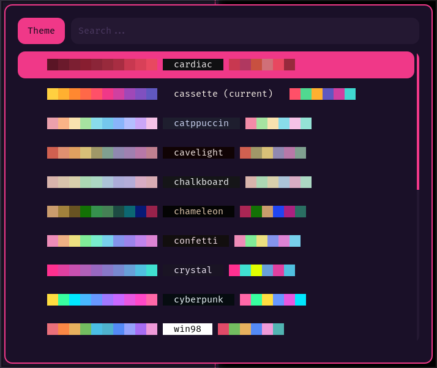

### Palettes

Each theme is defined by a single JSON file in `~/.config/themes/palettes/`. A palette contains:

```jsonc
{
  "description": "Theme description",
  "style": {
    "corner_radius": 3,
    "border_width": 1,
    "gaps_in": 5,
    "gaps_out": 10,
    "decoration": "none",          // "none" or "hyprbars"
    "bar": "rounded",              // powerline separator style
    "waybar": "rounded"            // waybar-specific override (optional)
  },
  "font": {
    "family": "FiraCode Nerd Font",
    "size": 11
  },
  "colors": {
    // structural
    "crust": "#11111b",
    "mantle": "#181825",
    "base": "#1e1e2e",
    "surface0": "#313244",
    // ...surfaces, overlays, text, subtext

    // gradient normals (theme-specific named colors)
    "red": "#f38ba8",
    "peach": "#fab387",
    // ...

    // gradient brights (L*0.94, C%+8, H+2 in OKLCH)
    "red_bright": "#e07a96",
    // ...

    // accents
    "accent": "#cba6f7",
    "accent_secondary": "#f5c2e7",
    "accent_tertiary": "#89b4fa",
    // ...with _bright variants

    // ANSI terminal colors
    "ansi_red": "red",             // can reference other color keys
    "ansi_green": "green",
    // ...

    // semantic
    "sem_ok": "ansi_green",
    "sem_warn": "ansi_yellow",
    "sem_err": "ansi_red",
    // ...

    // filetype colors
    "ft_code": "#89b4fa",
    "ft_data": "#f9e2af",
    // ...
  },
  "gradient": ["red", "peach", "yellow", "green", "teal",
               "sapphire", "blue", "lavender", "mauve", "pink"]
}
```

**Color key categories:**

| Category | Keys | Purpose |
|----------|------|---------|
| Structural | `crust` through `module_fg_light` | Background layers, text, module foreground |
| Gradient normals | Theme-specific names (10-14) | Primary palette colors |
| Gradient brights | `*_bright` for each normal | Darker, more chromatic variants |
| Accents | `accent`, `accent_secondary`, `accent_tertiary` + brights | Highlight and focus colors |
| ANSI | `ansi_red` through `ansi_magenta` + brights | Terminal color slots 0-15 |
| Semantic | `sem_ok`, `sem_warn`, `sem_err`, `sem_info`, `sem_link`, `sem_match`, `sem_cursor`, `sem_border`, `sem_selection` | Meaning-based colors |
| Filetype | `ft_code`, `ft_data`, `ft_media`, `ft_archive`, `ft_executable`, `ft_build`, `ft_ignore` | File listing colors |

Colors can **reference other keys** by name instead of specifying a hex value. The generator resolves these in two passes.

### Templates

Templates live in `~/.config/themes/templates/` and use `envsubst` variable syntax. Each template produces one output file per theme.

**Variable formats available for every color:**

| Format | Example | Use case |
|--------|---------|----------|
| `$RED` | `#f38ba8` | CSS, most configs |
| `$RED_NOHASH` | `f38ba8` | Configs that don't accept `#` |
| `$RED_RGB` | `243;139;168` | ANSI escape sequences |

**Additional variables:**

| Variable | Description |
|----------|-------------|
| `$THEME_NAME` | Current theme name |
| `$GRADIENT_0` – `$GRADIENT_9` | Resolved gradient colors |
| `$GRADIENT_FG_0` – `$GRADIENT_FG_9` | Auto-calculated contrasting foreground |
| `$STYLE_CORNER_RADIUS`, `$STYLE_GAPS_IN`, etc. | Style properties |
| `$FONT_FAMILY`, `$FONT_SIZE` | Font settings |
| `$WAYBAR_SEP_LEFT`, `$WAYBAR_SEP_RIGHT` | Powerline separator glyphs |

### Generation

```bash
# generate a single theme
~/.config/themes/scripts/generate-theme.sh catppuccin

# regenerate all themes in parallel
~/.config/themes/scripts/regenerate-all.sh

# regenerate all + rebuild cursor themes
~/.config/themes/scripts/regenerate-all.sh --cursors
```

The generator:

1. Reads the palette JSON with `jq`
2. Resolves color references (two-pass)
3. Calculates contrast foreground colors for each gradient stop
4. Maps powerline separator glyphs based on the `bar`/`waybar` style
5. Exports 100+ environment variables
6. Runs `envsubst` on every template to produce output files in `~/.config/themes/<name>/`

### Application

When you run `theme set <name>`, the system applies to each application in order:

| Application | Method |
|-------------|--------|
| Kitty | Config reload via `SIGUSR1` |
| Waybar | Process restart with new config + CSS |
| Rofi | Copy colors and font files |
| Hyprland | `hyprctl reload` |
| Hyprlock | Config copy (applies on next lock) |
| Shell tools | Update fzf, bat, eza, starship configs |
| TUI apps | Copy configs for lazygit, btop, ranger, etc. |
| Desktop | GTK/QT via `gsettings`, dunst icons, Firefox CSS |
| Cursors | Xcursor theme (applies on next session) |

### Overrides

Theme-specific overrides live in `~/.config/themes/templates/overrides/<theme-name>/`. Files placed here replace their corresponding base template output for that theme only.

Example: the Win98 theme uses overrides for rofi styling and shell colors to achieve its authentic retro look without affecting other themes.

## Creating a Custom Theme

1. **Copy an existing palette** as a starting point:
   ```bash
   cp ~/.config/themes/palettes/catppuccin.json ~/.config/themes/palettes/mytheme.json
   ```

2. **Edit the palette** — adjust colors, fonts, and style:
   ```bash
   theme edit mytheme
   ```

3. **Follow the key order convention:**
   - Structural colors (crust → module_fg_light)
   - Gradient normals (your named palette colors)
   - Gradient brights (matching `*_bright` for every normal)
   - Accents (accent, accent_secondary, accent_tertiary + brights)
   - ANSI colors (ansi_red through ansi_magenta + brights)
   - Semantic colors (sem_ok through sem_selection)
   - Filetype colors (ft_code through ft_ignore)

4. **Compute bright variants** using the OKLCH formula:
   - Lightness: `L * 0.94`
   - Chroma: `C + 8%`
   - Hue: `H + 2`

5. **Define your gradient** — pick 10 colors from your normals for the gradient array

6. **Generate and apply:**
   ```bash
   theme generate mytheme
   theme set mytheme
   ```

7. **Preview colors** without applying:
   ```bash
   theme preview mytheme
   ```

## Waybar

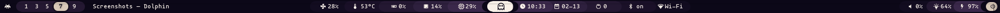

| Rounded | Slashes | Flames |
|---------|---------|--------|
| 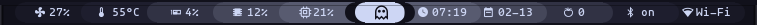 | 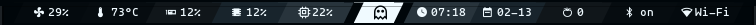 | 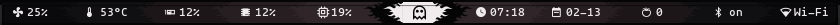 |

The waybar configuration lives in `~/.config/waybar/` and is template-driven — `config.jsonc` is regenerated from the theme system on every theme switch, embedding gradient colors directly into module definitions.

### Module Layout

**Left:** Workspaces (Hyprland) with scroll navigation

**Center:** Clock with calendar tooltip, Cava audio visualizer, media player (optional)

**Right:** Pomodoro timer, system tray, Wi-Fi, backlight, volume (PipeWire), CPU temp, GPU stats, fan speed, battery, power menu

Module groups are separated by powerline glyphs that adapt to the active theme's `bar` style setting.

### Waybar Scripts

All scripts live in `~/.config/waybar/scripts/` and output JSON (`{"text": "...", "tooltip": "...", "class": "..."}`) for waybar's custom module type.

#### System Monitoring

| Script | Module | Interval | Description |
|--------|--------|----------|-------------|
| `cpuinfo.sh` | `custom/temp` | 5s | CPU temperature and clock speed. Reads from `lm_sensors`, converts C→F, color-coded by temp threshold (red at 80°C+). Tooltip shows both units and frequency. |
| `gpuinfo.sh` | `custom/gpu` | 5s | NVIDIA GPU stats via `nvidia-smi`. Shows utilization %, temperature, memory usage, power draw, and clock speeds. Color-coded warnings at 70°C/80°C. |
| `fanspeed.sh` | `custom/fans` | 5s | Dual fan monitoring via `nbfc`. Displays the higher of two fan speeds with color coding (green/yellow/red). Scroll to adjust speed ±10%, click to toggle auto-control. |
| `fancontrol.sh` | — | on-demand | Fan speed adjustment backend. Called by `fanspeed.sh` scroll events. Supports `up`, `down`, `auto` commands with desktop notifications. |
| `batteryinfo.sh` | `custom/battery` | 30s | Battery status from `/sys/class/power_supply/BAT0` + `upower`. Shows charge %, health, power draw in watts, time remaining, cycle count, and manufacturer info. |

#### Productivity

| Script | Module | Interval | Description |
|--------|--------|----------|-------------|
| `pomodoro.sh` | `custom/pomodoro` | 1s | Full Pomodoro timer. 25min work / 5min short break / 15min long break, long break after 4 sessions. Click to toggle, middle-click to close, right-click to reset. Desktop notifications at 10/5/1 min remaining. Persistent state in `~/.local/state/pomodoro/`. |

#### Network

| Script | Module | Interval | Description |
|--------|--------|----------|-------------|
| `wifiinfo.sh` | `custom/wifi` | 10s | Wi-Fi connection details via `nmcli` + `iw`. Shows SSID, signal strength icon (5 tiers), IP, security, channel, Rx/Tx rates, and 802.11 standard detection (n/ac/ax). |
| `wifimenu.sh` | — | on-click | Interactive Wi-Fi manager. Launches a rofi menu to scan, connect, disconnect, or enter manual SSID/password. Centered on the focused monitor. |

#### Audio & Media

| Script | Module | Interval | Description |
|--------|--------|----------|-------------|
| `cava.sh` | `custom/cava` | realtime | Audio visualizer in the bar. Reads 8 frequency bars from `cava`, maps each to a gradient color from the theme CSS, renders using Unicode block characters (▁▂▃▄▅▆▇█). Suppresses output when silent. |
| `mediaplayer.py` | `custom/media` | event-driven | MPRIS media player display (currently disabled). Event-driven via GLib mainloop + playerctl. Shows artist/title, detects Spotify ads, handles multiple players. |

| Waybar Cava | Cava + Lyrics |
|:---:|:---:|
|  | 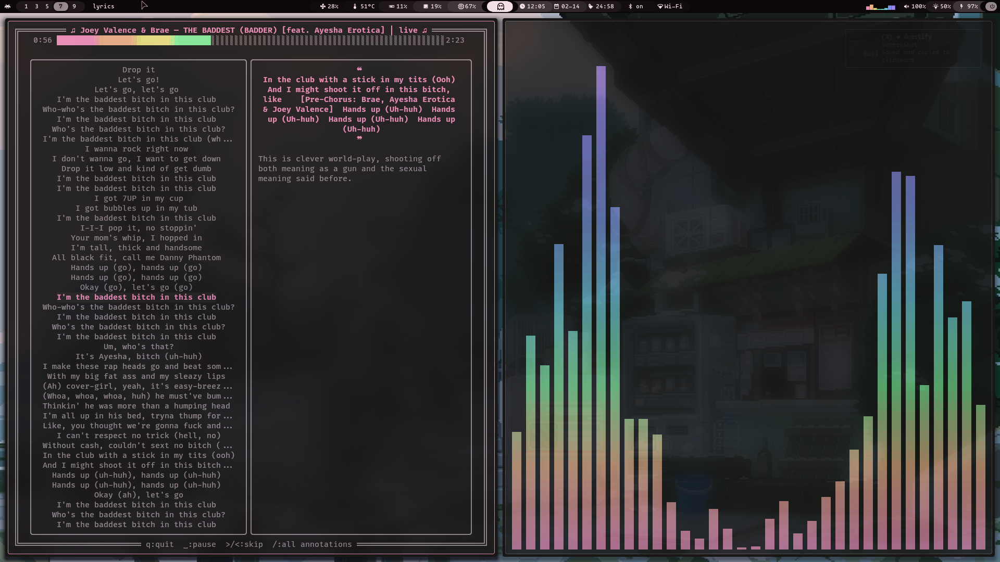 |

#### Workspace Management

| Script | Module | Interval | Description |
|--------|--------|----------|-------------|
| `workspace-scroll.sh` | — | on-scroll | Scroll-based workspace navigation. Single monitor: ±1 workspace. Dual monitor: ±2 (maintains odd/even per-monitor assignment). Smart bounds prevent sparse workspace creation — won't jump to workspace 13 if 11 is empty. Caps at 20. |
| `workspace-info.sh` | — | on-demand | Lists all open windows grouped by workspace for tooltip display. Highlights the active workspace, truncates long titles to 50 chars. |

#### Config Generation

| Script | Purpose |
|--------|---------|
| `generate-config.sh` | Regenerates `config.jsonc` from a template by extracting gradient colors from the current theme CSS. Maps specific gradient stops to semantic names (icon-red, icon-green, icon-blue, icon-orange, icon-muted) used in module definitions. |

## Hyprland


The Hyprland configuration uses a modular layout — `hyprland.conf` sources individual files from `~/.config/hypr/environment/`, keeping concerns separated.

### Configuration Structure

| File | Purpose |
|------|---------|
| `hyprland.conf` | Main entry point, sources all environment files in order |
| `environment/env.conf` | Environment variables — GPU config (NVIDIA), Wayland/X11 toolkit backends, Firefox settings, scaling |
| `environment/monitors.conf` | Display layout — eDP-1 (1080p laptop) + HDMI-A-1 (1440p external, 10-bit color) |
| `environment/execs.conf` | Session autostart — XDG portal, polkit agent, hypridle, waybar, hyprpaper, clipse, udiskie |
| `environment/general.conf` | Input (US layout, CapsLock→Esc, touchpad), dwindle layout, resize-on-border, VRR |
| `environment/theme.conf` | Appearance — gaps, borders, rounding, opacity (90%/75%), blur, shadows, borders-plus-plus plugin |
| `environment/rules.conf` | Window rules — floating dialogs, per-app opacity, workspace assignments (odd→laptop, even→external) |
| `environment/keybinds.conf` | All keybindings (see below) |
| `appearance/colors.conf` | Symlink to `~/.config/themes/current/hypr-colors.conf` — theme-provided color variables |
| `appearance/animations.conf` | Bezier curves and transition definitions (Material Design 3 curves, custom easing) |

### Keybinds

All bindings use `Super` as the primary modifier with vim-style `H/J/K/L` navigation.

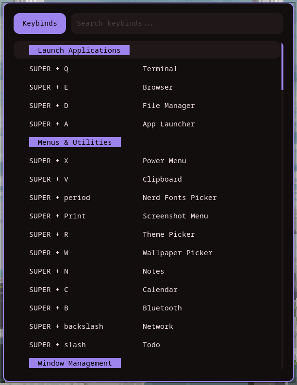

#### Application Launchers

| Keybind | Action |
|---------|--------|
| `Super + Q` | Terminal (Kitty) |
| `Super + E` | Browser (Firefox) |
| `Super + A` | App launcher (Rofi) |

#### Menus & Utilities

| Keybind | Action |
|---------|--------|
| `Super + X` | Power menu (shutdown / reboot / lock / logout) |
| `Super + V` | Clipboard manager (clipse in Kitty) |
| `Super + .` | Nerd Fonts glyph picker |
| `Super + Print` | Screenshot tool |
| `Super + W` | Wallpaper selector |
| `Super + N` | Notes |
| `Super + C` | Calendar |
| `Super + B` | Bluetooth manager |
| `Super + \` | Network / Wi-Fi manager |
| `Super + /` | Todo list |
| `Super + Shift + /` | Keybinds cheatsheet |
| `Super + Shift + P` | Color picker (`hyprpicker`, copies to clipboard) |

#### Window Management

| Keybind | Action |
|---------|--------|
| `Super + Backspace` | Close active window |
| `Super + F` | Maximize (fullscreen mode 1) |
| `Super + Shift + F` | True fullscreen (mode 0) |
| `Super + T` | Toggle floating / tiled |
| `Super + P` | Pseudo-tile |
| `Super + O` | Toggle split orientation |

#### Focus (vim-style)

| Keybind | Action |
|---------|--------|
| `Super + H / J / K / L` | Focus left / down / up / right |

#### Move Windows

| Keybind | Action |
|---------|--------|
| `Super + Shift + H / J / K / L` | Move window left / down / up / right |

#### Resize Windows

| Keybind | Action |
|---------|--------|
| `Super + Ctrl + H / L` | Shrink / expand width (50px) |
| `Super + Ctrl + K / J` | Shrink / expand height (50px) |

#### Snap to Half Screen

| Keybind | Action |
|---------|--------|
| `Super + Alt + H / J / K / L` | Snap left / bottom / top / right half |

#### Window Groups (Tabs)

| Keybind | Action |
|---------|--------|
| `Super + G` | Toggle group |
| `Super + Alt + G` | Remove from group |
| `Super + U / I` | Previous / next tab in group |
| `Super + Shift + Y / U / I / O` | Move window into group left / down / up / right |

#### Workspaces

| Keybind | Action |
|---------|--------|
| `Super + 1-9, 0` | Switch to workspace 1-10 |
| `Super + Shift + 1-9, 0` | Move window to workspace 1-10 |
| `Super + S` | Toggle scratchpad |
| `Super + Shift + S` | Move window to scratchpad |

#### Layout

| Keybind | Action |
|---------|--------|
| `Super + Up / Down` | Cycle next / previous in layout |
| `Super + Shift + Up / Down` | Swap with next / previous |
| `` Super + ` `` | Cycle orientation (left → right → bottom → top) |

#### Session

| Keybind | Action |
|---------|--------|
| `Super + Delete` | Lock screen (hyprlock) |
| `Super + Shift + Delete` | Exit Hyprland |

#### Media & Hardware

| Keybind | Action |
|---------|--------|
| `XF86AudioRaiseVolume / Lower / Mute` | Volume up / down / mute (via `volumecontrol`) |
| `XF86AudioMicMute` | Toggle mic mute |
| `XF86MonBrightnessUp / Down` | Brightness up / down (via `brightnesscontrol`) |
| `Print` | Screenshot full screen |
| `Alt + Print` | Screenshot region select |
| `Ctrl + Print` | Screenshot active window |

#### Mouse

| Keybind | Action |
|---------|--------|
| `Super + Left Click Drag` | Move window |
| `Super + Right Click Drag` | Resize window |

### Hyprland Scripts

Located in `~/.config/hypr/scripts/`:

| Script | Purpose |
|--------|---------|
| `snap-half.sh` | Snaps the active window to half the screen (left/right/top/bottom). Queries the focused monitor geometry, accounts for reserved bar space, compensates for `hyprbars` and `borders-plus-plus` plugin decorations, then positions the window with exact pixel calculations. |
| `set-cursor.sh` | Reads the cursor theme and size from the theme-provided `colors.conf`, then applies them via `hyprctl setcursor` and sets `XCURSOR_*` / `HYPRCURSOR_*` environment variables for toolkit compatibility. |
| `xdg-desktop-portal-reset.sh` | Restarts XDG Desktop Portal services on session startup. Kills existing portal processes and restarts the Hyprland-specific portal followed by the generic portal — required for screen sharing to work. |

### Shaders

Eight fragment shaders in `~/.config/hypr/shaders/` for visual effects: CRT monitor simulation, chromatic aberration, night mode (blue light filter), color inversion, solarized/extradark overlays, and a trippy `drugs.frag`.

### Idle & Lock

**Hypridle** manages progressive idle actions:

| Timeout | Action |
|---------|--------|
| 2.5 min | Dim screen to 10% brightness |
| 4.5 min | Warning notification ("Locking in 30 seconds...") |
| 5 min | Lock screen (hyprlock) |
| 5.5 min | Display off (DPMS) |
| 30 min | Suspend |

The system also locks before sleep and restores DPMS after wake.

**Hyprlock** uses a screenshot background with blur and dimming, layered labels for time, date, and a custom prompt, and dot-style password input — all themed from the palette.

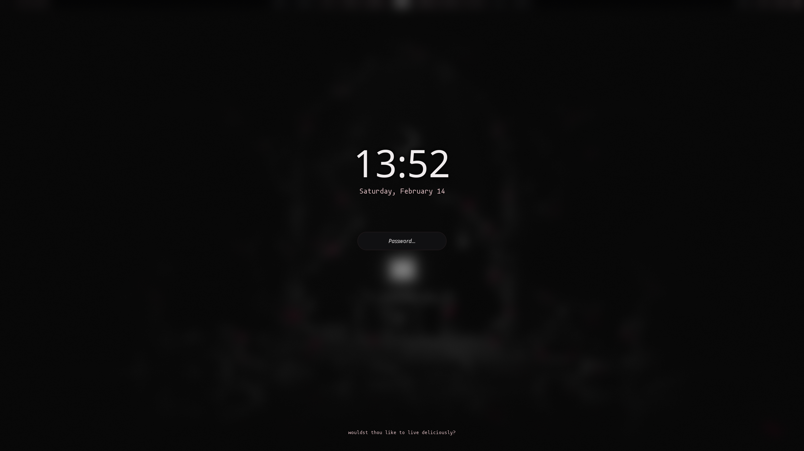

## Rofi Applets

| App Launcher | Nerd Fonts Picker | Screenshot Menu |
|:---:|:---:|:---:|
| 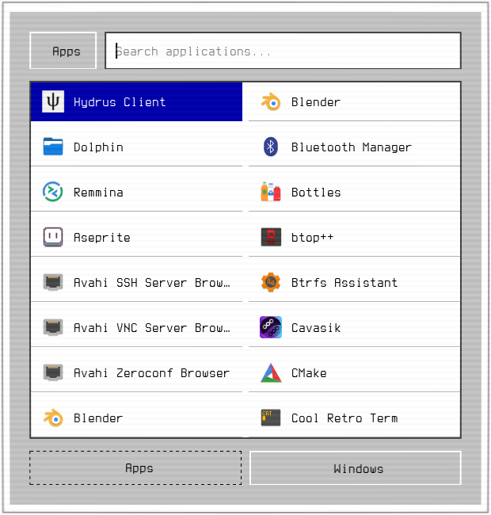 | 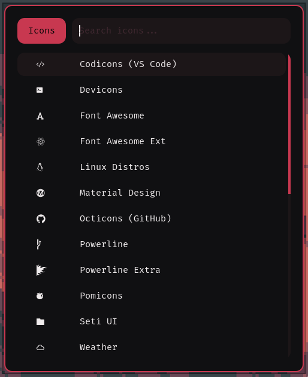 | 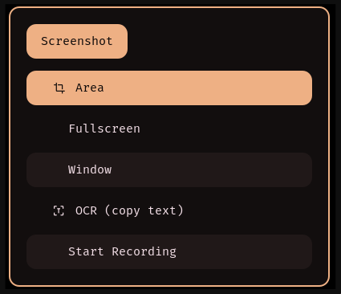 |

Eleven custom applets in `~/.config/rofi/scripts/`, each with its own themed `style.rasi`. All applets use the theme system's colors via symlinked `colors.rasi` and `fonts.rasi`.

| Applet | Description |
|--------|-------------|
| **launcher** | Application launcher using freedesktop `.desktop` entries |
| **bluetooth** | Bluetooth device manager — scan, pair, connect, trust via `bluetoothctl` |
| **network** | Wi-Fi manager — scan networks, connect with password prompts, toggle on/off via `nmcli` |
| **screenshot** | Screen capture menu — region, fullscreen, window, OCR text extraction (tesseract), OBS recording toggle |
| **calendar** | Interactive calendar — navigate months, set reminders with custom times |
| **todo** | Task manager — add, toggle complete, delete tasks (persisted to `~/.local/share/todo.txt`) |
| **notes** | Markdown note manager — create (with YAML frontmatter), edit, delete notes in `~/.local/share/notes/` |
| **keybinds** | Hyprland keybind cheatsheet — parses `keybinds.conf` and displays grouped shortcuts |
| **powermenu** | Session control — lock, suspend, logout, reboot, shutdown (with confirmation prompts) |
| **nerdfonts** | Nerd Font icon picker — browse by category (Codicons, Devicons, Font Awesome, Material, Octicons, Powerline, Weather), copy glyph to clipboard |
| **wallpaper** | Wallpaper picker — thumbnail grid via ImageMagick, set via swww/hyprpaper, triggers theme color extraction |

## Dunst

| Pomodoro Notifications | Volume & Brightness Bars |
|:---:|:---:|
| 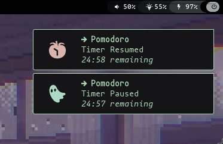 | 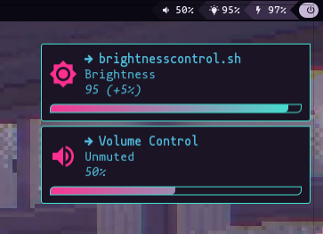 |

Notification daemon with full theme integration — colors, icons, and styling all adapt to the active palette.

### Configuration

The main config (`~/.config/dunst/dunstrc`) is theme-agnostic. Theme colors load via a drop-in file:

```
~/.config/dunst/
├── dunstrc                     # static config (layout, format, timeouts)
├── dunstrc.d/
│   └── 00-colors.conf          # symlink → ~/.config/themes/current/dunst-colors.conf
└── icons/                      # symlink → ~/.config/themes/current/dunst-icons/
```

Notable settings: top-right origin on monitor 2, 300px width, 5px gap between stacked notifications, Mononoki Nerd Font, rounded corners (adapts to theme's `corner_radius`), and Papirus-Dark fallback icons.

Notification format uses nerd font glyphs: `<b>󰁕 %a</b>\n%s\n<i>%b</i>`

### Color Template

The color config (`dunst-colors.conf.tmpl`) maps urgency levels to semantic palette colors:

| Urgency | Frame Color | Text Color | Icon |
|---------|------------|------------|------|
| Low | `sem_ok` (green) | `sem_ok` | `bell-badge-low.svg` |
| Normal | `sem_border` | `sem_info` | `bell-badge.svg` |
| Critical | `sem_err` (red) | `sem_err` | `alert-decagram.svg` |

Global background uses `base`, foreground uses `text`, and highlight uses `accent` + `sem_ok`.

### Themed SVG Icons

25 SVG icon templates in `~/.config/themes/templates/dunst-icons-tmpl/` are processed through `envsubst` during theme generation, embedding palette colors directly into the SVG `fill` attributes.

**Volume icons** (3 levels, colored with `accent`):

| Icon | Description |
|------|-------------|
| `muted.svg` | Speaker with X — muted state |
| `volume-1.svg` | Single sound wave — low volume |
| `volume-2.svg` | Double sound wave — medium volume |
| `volume-3.svg` | Triple sound wave — high volume |

**Brightness icons** (7 tiers, colored with `accent`):

`brightness-1.svg` through `brightness-7.svg` — sun icon with increasing ray intensity, selected by dividing current brightness into 15% bands.

**Pomodoro icons** (state-specific semantic colors):

| Icon | Color Variable | State |
|------|---------------|-------|
| `POMODORO_TICKING.svg` | `sem_err` (red) | Active work session |
| `POMODORO_DONE.svg` | `sem_ok` (green) | Session completed |
| `SHORT_PAUSE.svg` | `sem_info` (cyan) | Short break |
| `LONG_PAUSE.svg` | `sem_info` (cyan) | Long break |
| `AWAY.svg` | `accent_tertiary` | Paused/away |
| `POMODORO_ESTIMATED.svg` | `sem_warn` (yellow) | Estimated time |

Plus additional pomodoro state icons: `CLEAN_CODE`, `PAIR_PROGRAMMING`, `EXTERNAL_INTERRUPTION`, `INTERNAL_INTERRUPTION`, `POMODORO_SQUASHED`.

**Notification badges:**

| Icon | Color | Purpose |
|------|-------|---------|
| `bell-badge.svg` | `accent` | Default normal notification |
| `bell-badge-low.svg` | `sem_ok` | Low urgency notification |
| `alert-decagram.svg` | `sem_err` | Critical notification |

### Script Integration

Scripts select icons dynamically based on current values:

**Volume** (`volumecontrol`) — maps volume percentage to icon tier: `volume-$((vol / 34 + 1)).svg`. Notifications use `-r 2` for in-place replacement and `-h int:value:$vol` for a progress bar overlay.

**Brightness** (`brightnesscontrol`) — maps brightness to icon tier: `brightness-$((brightness / 15 + 1)).svg`. Uses `-r 1` replacement ID and 800ms timeout for snappy feedback.

**Pomodoro** (`pomodoro.sh`) — selects icon by timer state (work → `POMODORO_TICKING`, break → `SHORT_PAUSE`/`LONG_PAUSE`, done → `POMODORO_DONE`). Sends warnings at 10/5/1 minute marks.

### Theme Override: Win98

The Win98 override strips nerd font glyphs from the format string, sets `corner_radius = 0`, increases `frame_width` to 2, and switches to Tahoma font — matching the classic rectangular notification style.

### Context Menu

A custom `dunst-dmenu` script at `~/.local/bin/dunst-dmenu` routes notification context actions through rofi instead of the default dmenu, maintaining visual consistency with the rest of the desktop.

## Wlogout

Themed logout menu with two layout presets and a custom icon set (black and white variants for each action). Six actions — lock, logout, suspend, hibernate, shutdown, reboot — each bound to a key (`l/e/u/h/s/r`). CSS styling is generated per-theme with button states and transitions.

## Kitty

The primary terminal emulator, configured in `~/.config/kitty/kitty.conf` with theme colors applied via symlinked `current-theme.conf` and `current-font.conf`. Notable customization includes 50+ keybindings (tabs, splits, URL hints, scrollback pager), a powerline-styled tab bar, 50,000-line scrollback history, vim-style hints for paths/words/hashes, and remote control via socket.

## Fastfetch

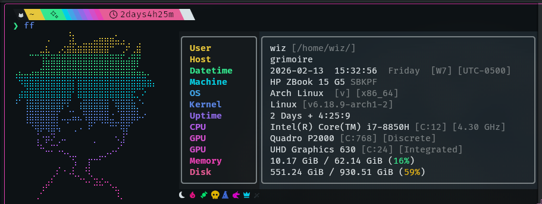

Fastfetch displays system information alongside gradient-colored ASCII art. The configuration is fully theme-driven.

### ASCII Art

The art in `~/.config/fastfetch/ascii.txt` is a 16-line figure rendered with Braille Unicode characters. Nine color placeholders (`$1`–`$9`) flow top to bottom:

```
Lines 1–2:    $1    ─┐
Lines 3–4:    $2     │
Lines 5–6:    $3     │
Lines 7–8:    $4     ├── gradient flows top → bottom
Lines 9–10:   $5     │
Lines 11–12:  $6     │
Lines 13–14:  $7     │
Lines 15–16:  $8–$9 ─┘
```

Each `$N` maps to `GRADIENT_N-1` from the palette's gradient array via the template:

```jsonc
"color": {
  "1": "${GRADIENT_0}",
  "2": "${GRADIENT_1}",
  // ...
  "9": "${GRADIENT_8}"
}
```

### Info Modules

The output is framed in a bordered box (box-drawing characters) with gradient-colored labels. Each module's label uses a different gradient stop for a rainbow effect:

| Module | Gradient Color | Info Displayed |
|--------|---------------|----------------|
| User | `GRADIENT_0` | Username + home path |
| Host | `GRADIENT_1` | Hostname |
| Datetime | `GRADIENT_2` | Full date/time with timezone, weekday, week number |
| Machine | `GRADIENT_3` | Hardware model + version |
| OS | `GRADIENT_4` | Distro, codename, version, architecture |
| Kernel | `GRADIENT_5` | Kernel name + release |
| Uptime | `GRADIENT_6` | Days, hours, minutes, seconds |
| CPU | `GRADIENT_7` | Processor, core count, max frequency |
| GPU | `GRADIENT_8` | GPU name, core count, type (one row per GPU) |
| Memory | `GRADIENT_9` | Used / total with percentage |
| Disk | `GRADIENT_0` | Used / total with percentage |

### Theme Integration

The template (`fastfetch.jsonc.tmpl`) uses three structural color variables for the box frame:

| Variable | Role |
|----------|------|
| `SURFACE0_RGB` | Key label background |
| `SURFACE1_RGB` | Output value background |
| `SUBTEXT0_RGB` | Border and separator lines |

These adapt to each theme — dark themes get dark frames, light themes get light frames, and the Win98 theme gets its characteristic gray boxes.

## Zsh

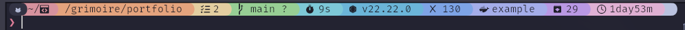

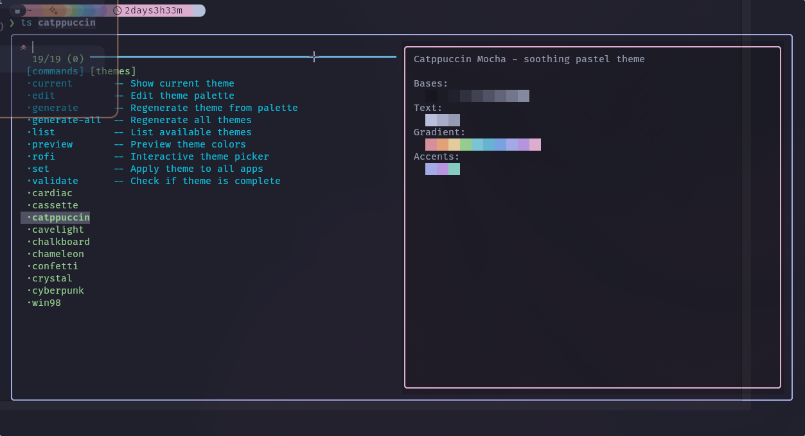

The shell configuration lives in `~/.config/zsh/` (via `ZDOTDIR`) and follows XDG Base Directory conventions throughout. It uses a modular structure with 11 sourced files, deferred plugin loading for fast startup, and deep fzf integration across completions, finders, and the Starship prompt.

### Module Structure

| File | Purpose |
|------|---------|
| `.zshrc` | Entry point — sources all modules in order |
| `env.zsh` | Environment variables, XDG paths, PATH, tool configs (nnn, ripgrep, less, manpager) |
| `options.zsh` | Shell options — auto-cd, extended globs, case-insensitive matching, no-clobber, spelling correction |
| `history.zsh` | History config — 100k memory / 50k saved, shared across sessions, timestamped, incremental append |
| `theme.zsh` | Sources `~/.config/themes/current/shell-colors.sh` for LS_COLORS, EZA_COLORS, GREP_COLORS |
| `completions.zsh` | Completion engine with fzf-tab integration and per-command preview rules |
| `plugins.zsh` | Zinit plugin loader with deferred loading |
| `prompt.zsh` | Starship prompt init with vi-mode keymap tracking |
| `alias.zsh` | Aliases organized by category |
| `functions.zsh` | 500+ lines of custom shell functions |
| `finders.zsh` | FZF-based finder utilities |
| `keybinds.zsh` | Key bindings including custom widgets |

### Plugins

Managed by **Zinit** with a deferred loading strategy to keep startup fast:

| Plugin | Load Time | Purpose |
|--------|-----------|---------|
| `zsh-completions` | Immediate | Extra completion definitions |
| `dotbare` | Immediate | Bare git repo management completions |
| `fzf-tab` | Deferred | Replace zsh completion menu with fzf |
| `zsh-history-substring-search` | wait=1 | Partial history matching with arrow keys |
| `zsh-autosuggestions` | wait=1 | Fish-style inline suggestions |
| `fast-syntax-highlighting` | wait=2 | Syntax-aware command coloring (must load last) |
| `starship` | Binary | Cross-shell prompt |

### Aliases

Organized by category with safe defaults:

| Category | Examples |
|----------|---------|
| File listing | `l`, `la`, `ll`, `lt` — all via `eza` with icons, git status, and theme colors |
| File ops | `rm` → `trash` (safe delete), `cp -ri`, `mv -i` (confirm overwrites), `sync` → `rsync` |
| Git | `gst` (status), `gp` (push), `gc` (commit), `glog` (decorated log) |
| Navigation | `..`, `...`, `....` (up N dirs) |
| Package manager | `pup` (paru update), `pun` (paru uninstall) |
| Dotfiles | `dotbare` (bare git), `ts` (theme set), `wp` (wallpaper) |
| Help | `help` — global alias piping `--help` through `bat` with syntax highlighting |

### Custom Functions

Over 500 lines of shell functions spanning several categories:

**File & Navigation:**
`mkcd` (create + cd), `up N` (go up N dirs), `bak` (timestamp backup), `sizeof` (directory size), `findlarge`, `findrecent`

**Network:**
`myip` (public IP), `port` (check open port), `serve` (local HTTP server), `transfer` (upload to transfer.sh), `weather` (wttr.in)

**Development:**
`json` (pretty-print with bat), `gitignore` (fetch templates), `gclone` (clone + cd), `gitstats` (commit/line counts)

**System:**
`topmem`, `topcpu` (resource usage), `sysinfo` (system overview), `palette` (256-color display), `histats` (most-used commands)

**Package Management (paru/pacman):**
`psearch` (search + install with AUR indicator), `parup` (interactive update), `parebuild` (rebuild after library updates), `pinl`/`pclean`/`parown`/`pwhich` (package queries)

**Interactive TUIs:**
`dps` (Docker container browser), `dim` (Docker image browser), `pskill` (process killer with tree view), `slist` (systemd service browser), `tls` (trash browser with restore/delete)

**Git (fzf-powered):**
`gco` (branch checkout), `gflog` (commit log viewer), `gadd` (interactive staging with diffs), `gstash` (stash manager)

### Zsh Key Bindings

Custom widgets and bindings beyond defaults:

| Keybind | Action |
|---------|--------|
| `Esc Esc` | Prepend/remove `sudo` on current line |
| `Ctrl + Y` | Copy current line to clipboard (wl-copy) |
| `Ctrl + O` | Open file manager in current directory |
| `Ctrl + G` | Show git status |
| `Alt + H` | Context help — tries man, then `--help` through bat |
| `Ctrl + X =` | Calculator (bc via fzf) |
| `Alt + Up` | cd to parent directory |
| `Alt + Left` | cd back (cd -) |
| `Ctrl + P / N` | History substring search up/down |
| `Ctrl + X Ctrl + E` | Edit command in `$EDITOR` |

### Completion System

The completion system uses **fzf-tab** to replace the standard menu with fzf, adding context-aware previews for every completion type:

| Context | Preview |
|---------|---------|
| Files | `bat` with syntax highlighting (or `eza` tree for directories) |
| Git branches | Commit log for that branch |
| Git diff/add | Colored diff of the file |
| Docker containers | JSON inspect output |
| Systemd units | Service status |
| Processes | Process tree (`pstree`) |
| Packages | Package info (`paru -Si`) |
| SSH hosts | Config block for that host |
| Commands | Alias definition → function body → tldr → man page → which output |
| `theme set` | `theme preview` color swatches |
| `wallpaper` | Image thumbnail via `chafa` |

Custom completions are registered for `theme`, `wallpaper`, `volumecontrol`, `brightnesscontrol`, and `unarchive`.

### fzf

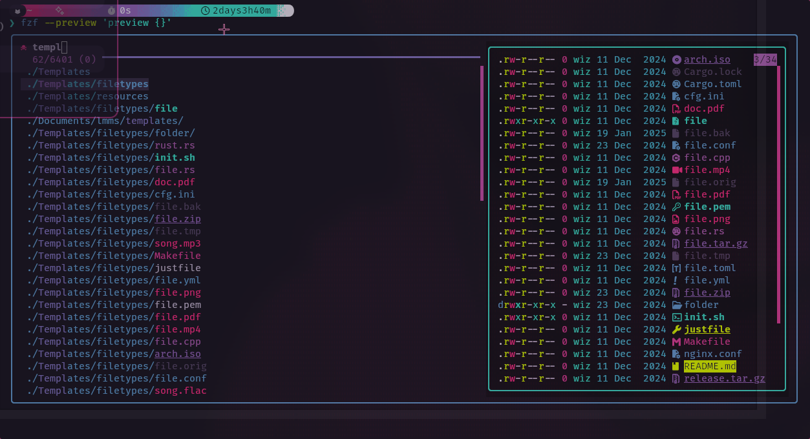

fzf serves as the primary interactive selection interface, powering file finding, history search, completions, and a suite of custom finders in `finders.zsh`:

| Finder | Purpose |
|--------|---------|
| `fe` | Edit file — find with preview, open in `$EDITOR` |
| `fo` | Open file — find with preview, open via `xdg-open` |
| `fcd` | Change directory — fuzzy cd with tree preview |
| `frg` | Ripgrep search — results open in editor at the matching line |
| `frgi` | Interactive ripgrep — re-searches as you type |
| `fman` | Man page browser |
| `fenv` | Browse environment variables |
| `fpath` | Browse `$PATH` directories |
| `fssh` | SSH host picker from `~/.ssh/config` |
| `fz` | Zoxide directory jumper (frecency-based) |
| `fbm` | Bookmark manager — add, delete, browse saved paths |
| `fnotes` | Notes browser — search and open markdown notes |
| `fhist` | History search with edit/copy actions |

**Default keybindings:**

| Key | Action |
|-----|--------|
| `Ctrl + T` | Find file — preview with bat, `Ctrl+E` to edit, `Ctrl+Y` to copy path, `Ctrl+O` to open |
| `Ctrl + R` | Search history — `Ctrl+Y` to copy command |
| `Alt + C` | Find directory and cd into it |
| `Ctrl + /` | Toggle preview window position (right ↔ bottom) |

File discovery uses `bfd` — a custom wrapper that combines `bfs` (breadth-first, fast for shallow trees) with `fd` (deep recursive search) for optimal speed.

fzf colors are generated per-theme from `shell-colors.sh.tmpl`, mapping palette colors to fzf's color options — structural colors for background, accents for borders, semantic match color for highlighting, and gradient colors for the pointer and marker.

### Starship Prompt

| Collapsed | Expanded |
|:---------:|:--------:|
| 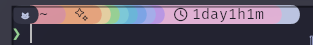 |  |

The Starship prompt (`~/.config/starship/starship.toml`) displays a powerline-style chain of segments, each colored with a gradient stop:

```
 ❯ ~/projects/dotbare  main +2 ~1  3.12.0  2.1s  ✘ ❯
 ↑        ↑              ↑           ↑       ↑    ↑  ↑
 logo   directory      git        python  duration │ character
                                                 exit
```

**Segments (left to right):** Logo → Directory (split into two parts via custom script) → Jobs → Git branch + status → Duration (>500ms) → Language runtimes (C, Rust, Go, Node, PHP, Java, Kotlin, Haskell, Python) → Exit status → Docker context → System updates → Uptime → Character

The theme system generates a `[palettes.*]` block for each theme with 10 gradient stops (g0–g9), foreground pairs, and semantic colors. Theme switching updates `palette = "theme-name"` and the prompt immediately reflects the new colors. Separator formats are also theme-driven — the `bar` style selects between rounded, angular, flame, pixel, and slash templates.

## Desktop Theming

The theme system handles GTK and Qt toolkit theming through `lib/apps/desktop.sh`:

- **GTK3/4** — generated `gtk.css` with theme colors, applied via `gsettings`
- **Qt5/Qt6** — color schemes for `qt5ct`/`qt6ct`
- **Kvantum** — SVG-based Qt theme selection
- **Cursors** — Xcursor theme and size from palette, applied via `hyprctl` and environment variables
- **Icons** — icon theme selection per palette
- **Firefox** — `userChrome.css` with imported `theme-colors.css` for browser UI theming, plus Stylus extension styles for web content
- **Spicetify** — Spotify client theming

## Themed Applications

Beyond the apps with dedicated sections above, the theme system generates configs for:

| Application | Config |
|-------------|--------|
| Lazygit | Custom color themes (border, selected line, author colors) |
| GitUI | Color scheme via `gitui.ron` |
| btop | Theme file + vim keybindings, 3 layout presets |
| Ranger | Custom colorschemes (Python) |
| Bat | Syntax highlighting theme (`.tmTheme`) + config |
| Glow | Markdown viewer style (`glow.json`) |
| Cava | Audio visualizer colors (standalone + waybar configs) |
| Clipse | Clipboard manager with 21-property color theme |
| Sptlrx | Spotify lyrics TUI colors |
| YouTube-TUI | Video browser colors |

## Custom Scripts

Notable scripts in `~/.local/bin/`:

| Script | Purpose |
|--------|---------|
| `theme` | Main theme CLI — set, list, generate, preview, validate, edit, rofi picker |
| `wallpaper` | Wallpaper setter with color extraction for chameleon theme |
| `screenshot` | Screenshot capture — region, window, fullscreen (integrates with rofi applet) |
| `volumecontrol` | PipeWire audio control — increase/decrease/mute with notification icons |
| `brightnesscontrol` | Backlight control with notification feedback |
| `bfd` | Hybrid file discovery — combines `bfs` (breadth-first, fast) with `fd` (deep recursive) |
| `directory-split` | Splits directory paths into two segments for starship prompt display |
| `unarchive` | Universal archive extractor (tar, zip, 7z, rar, etc.) |
| `preview` | File preview dispatcher for fzf/rofi (bat for text, eza for dirs, mediainfo for media) |
| `checkupdates-cached` | Cached package update counter for waybar/starship modules |
| `gamemode.sh` | Toggle game mode (disable compositor effects, change governor) |
| `lyrics` | Terminal lyrics viewer — synced lyrics from lrclib + Genius annotations (see below) |
| `reminder-*.sh` | Reminder system — add, check, list reminders (integrates with rofi calendar) |

### Lyrics


A curses-based terminal lyrics viewer (`~/.local/bin/lyrics`) that displays synced lyrics for the currently playing track via MPRIS (playerctl). Reads the active theme palette directly and renders with full gradient colors.

**Features:**

- **Synced lyrics** from [lrclib.net](https://lrclib.net/) — fetches by exact match (artist/title/album/duration) with search fallback
- **Genius annotations** — optional lyric-by-lyric explanations via the Genius API (token stored in `~/.config/lyrics/genius_token`)
- **Gradient progress bar** — maps the palette's gradient array across the bar width with fractional-block fill precision (Unicode eighth-blocks) and dithered color transitions between gradient stops
- **Theme integration** — reads the current palette JSON to set accent, subtext, surface, and mantle colors via curses color pairs; gradient stops color the progress bar
- **Three annotation modes** — cycle with `/`: off → live (split view, annotation tracks current line) → all (scrollable list of every annotation, vim-style `j/k/g/G` navigation)
- **Playback control** — `space` to pause, `<`/`>` to skip tracks

**Layout:**

```
╔══════════ ♫ Artist — Title ♫ ═══════════╗
║ 1:23 ████████████▌░░░░░░░░░░░░░░░ 3:45  ║
║ ╭──────────────────────────────────────╮ ║
║ │          previous lyric line         │ ║
║ │        ▸ current lyric line ◂        │ ║
║ │           next lyric line            │ ║
║ ╰──────────────────────────────────────╯ ║
╚══ q:quit  ␣:pause  >/<:skip  /:annot ═══╝
```

### Terminal Toys


A collection of terminal screensavers and ASCII art generators in `~/.local/bin/` and `~/.local/bin/ascii/`:

| Script | Description |
|--------|-------------|
| `banana` | 3D spinning banana with lighting simulation and RGB colors (Python) |
| `pacpipes` | Pac-Man eating through a dot-filled screen with theme-colored trails |
| `pipes`, `pipes1`, `pipes2` | Classic terminal pipes screensavers |
| `unimatrix` | Matrix rain animation |
| `nyan` | Nyan Cat animation |
| `thisisfine` | Animated "This is Fine" meme |

Plus 70+ additional ASCII art scripts and color palette demos.

## Repository Structure

```
~/.dotfiles/                              # bare Git repository

~/.config/themes/                         # theme system
├── palettes/                             # 10 palette definitions (JSON)
├── templates/                            # 30+ envsubst templates
│   ├── overrides/                        # theme-specific overrides
│   └── dunst-icons-tmpl/                 # notification icon templates
├── scripts/                              # generate, preview, build scripts
├── lib/                                  # shared libraries + 9 app handler modules
├── current/                              # active theme (symlinked files)
└── <theme-name>/                         # generated output per theme

~/.config/hypr/                           # Hyprland window manager
├── hyprland.conf                         # main config (sources environment/)
├── environment/                          # env, monitors, execs, general, theme, rules, keybinds
├── appearance/                           # colors (symlink), animations
├── scripts/                              # snap-half, set-cursor, xdg-portal-reset
├── hypridle.conf                         # idle timeouts + actions
├── hyprlock.conf                         # lock screen layout
└── hyprpaper.conf                        # wallpaper engine

~/.config/waybar/                         # panel / taskbar
├── config.jsonc                          # module layout (generated from theme)
├── style.css                             # base styles (@imports theme.css)
└── scripts/                              # 15 monitoring, control, and utility scripts

~/.config/zsh/                            # shell configuration (11 modules)
~/.config/rofi/                           # launcher + 12 custom applets
~/.config/starship/                       # prompt layout + theme palettes
~/.config/fastfetch/                      # system info + gradient ASCII logo
~/.config/kitty/                          # terminal emulator
~/.config/lazygit/                        # git TUI
~/.config/btop/                           # system monitor
~/.config/dunst/                          # notifications
~/.config/                                # ...50+ more app configs

~/.local/bin/                             # custom scripts (theme, wallpaper, bfd, etc.)
└── ascii/                                # 70+ ASCII art scripts
```

---

> Thank you for checkin' them out (´°ω°`)
